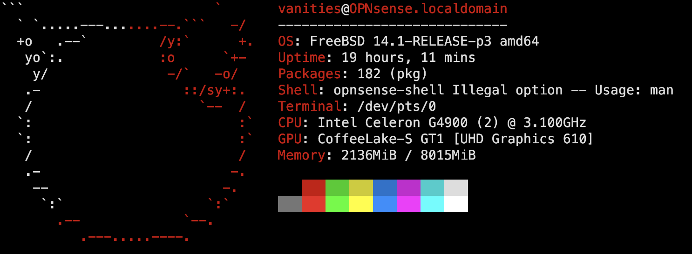

This repository contains the configuration files and backup scripts for my opnSense firewall/router setup.




## Configuration Files

This repo contains the following configuration file in an encrypted zip:

- `config.xml`: The main opnSense configuration file.

## Backup Scripts

The `Makefile` contains the backup script:

- `make backup`: A shell script to backup the opnSense configuration xml and encrypt it into a zip.

## Usage

To use this repository:

1. Clone the repository to your local machine:
   ```
   git clone https://github.com/vanities/opnsense.git
   ```

2. Customize the configuration files in the `config` directory to match your pfSense setup.

3. Run the backup scripts in the `scripts` directory to backup your pfSense configuration and packages and input a password to encrypt it:
   ```
   make backup
   ```

4. Commit and push your changes to the repository to keep your backups up to date:
   ```
   git add .
   git commit -m "Update opnsense backups"
   git push
   ```

## License

This project is licensed under the MIT License - see the [LICENSE](LICENSE) file for details.
